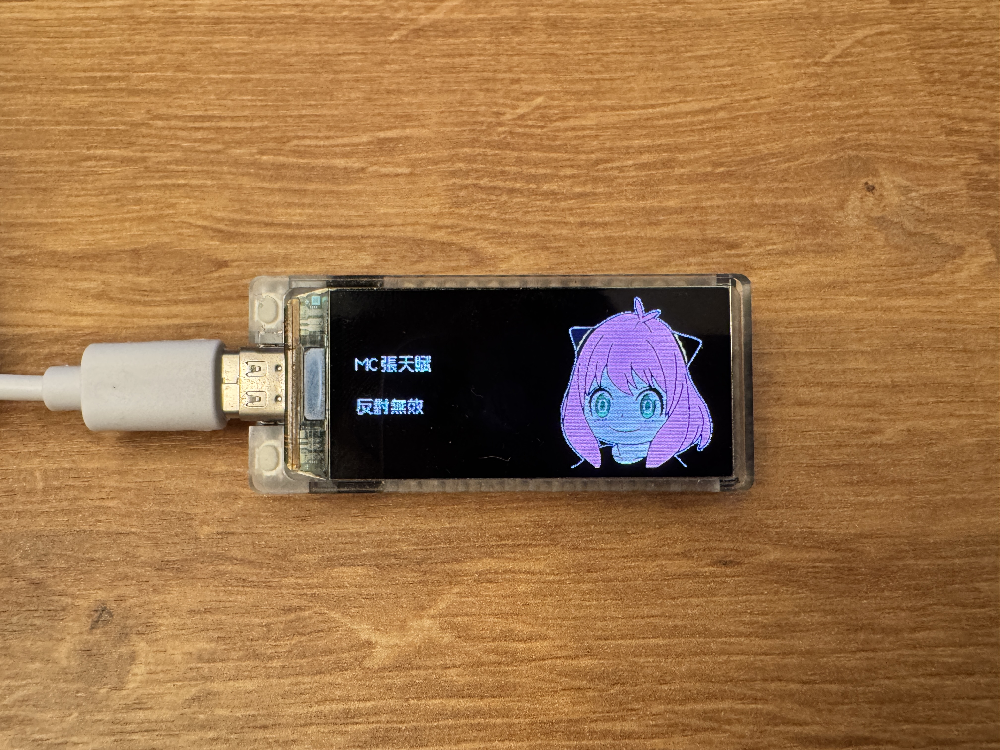
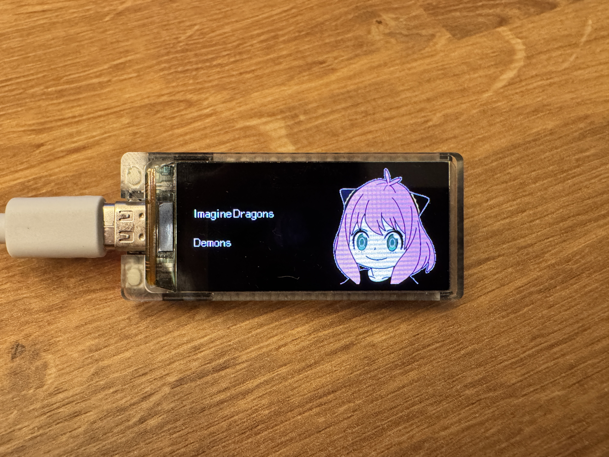
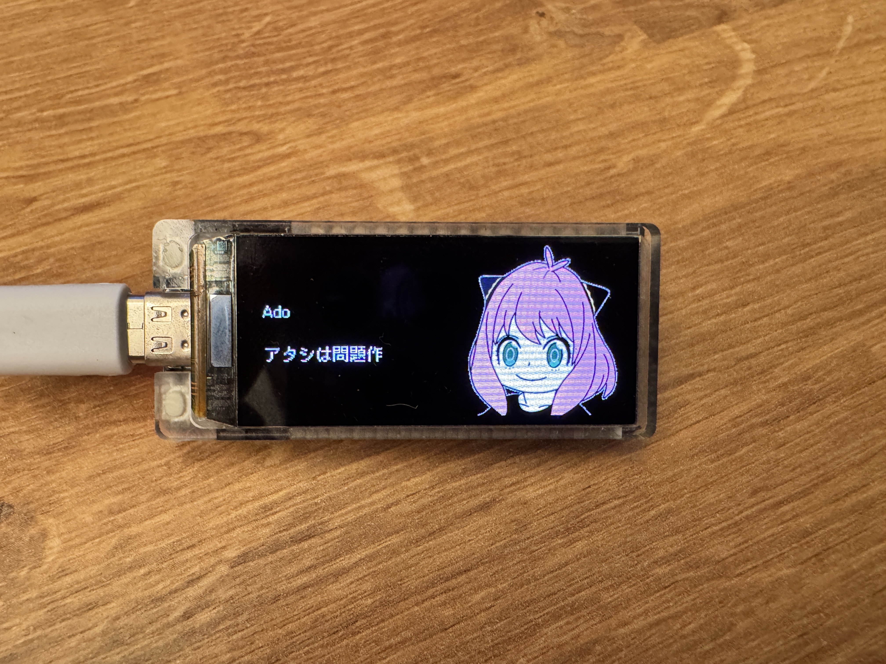
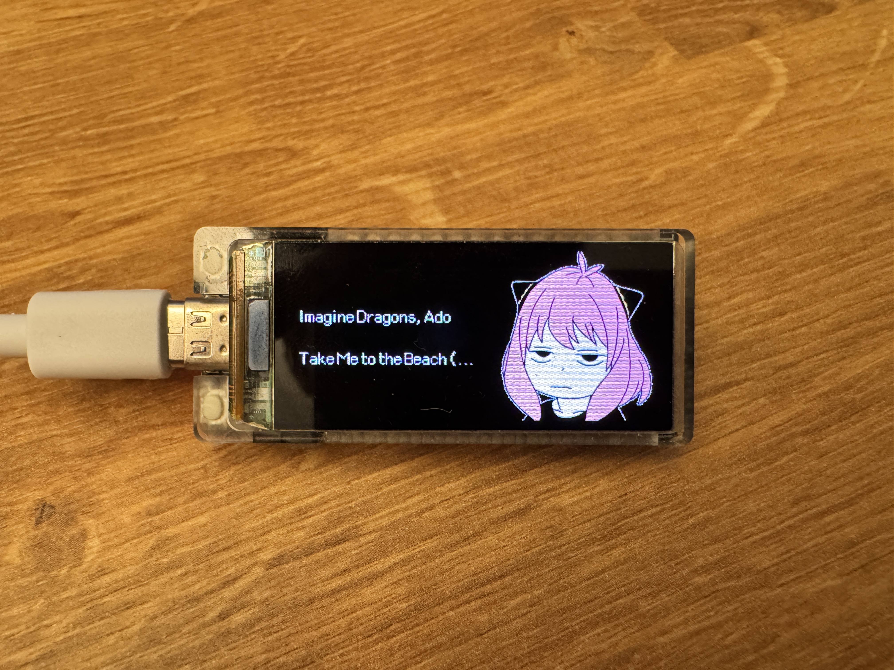

# ESP32 Spotify Display

A Spotify now-playing display for the LilyGo T-Display S3 that shows currently playing track information on the built-in
AMOLED display.

## Features

- Wi-Fi connectivity with automatic configuration portal and auto-reconnection
- Spotify integration showing current artist and track
- 7-level adjustable brightness control via hardware button
- Custom font support

### Demo Images
Showing track information in multiple languages:




Music playing/paused image changes:



## Hardware Requirements

- LilyGo T-Display S3 (ESP32-S3 with AMOLED display)
- USB-C cable for programming

## Software Requirements

- PlatformIO IDE
- Required libraries (automatically installed via platformio.ini):
    - ESPAsyncWebServer
    - ArduinoJson
    - AsyncTCP
    - base64
    - TFT_eSPI

## Setup

1. **Clone the repository**

2. **Create configuration file**:
    - Copy `src/__example_custom_config.h__` to `src/custom_config.h`
   ```bash
    cp src/__example_custom_config.h__ src/custom_config.h
    ```
    - Add your Spotify API credentials


3. **Create data directory**:
   ```bash
   mkdir data
   ```

4. **Add font files and convert images** (if using custom fonts):
    - Font files:
        - Place your font files in the data directory
        - Create custom fonts at: https://vlw-font-creator.m5stack.com/
        - User can use word.txt for reference when creating fonts
    - Images to header files:
        - Convert images to C header files using: https://github.com/lo2003058/Images2cHeader
        - Store header files in src/images/ directory (recommended resolution: 240x240)
        - Import in assetsImport.h to use in your application


5. **Upload filesystem**:
   ```bash
   pio run --target uploadfs
   ```

6. **Compile and upload**:
   ```bash
   pio run --target upload
   ```

## Configuration

### Spotify API Setup

1. Create a Spotify Developer account at https://developer.spotify.com
2. Create a new application to get your Client ID and Secret
3. Generate a refresh token using Spotify's authorization flow
4. Update these values in `custom_config.h`

### WiFi Configuration

On first boot, the device creates an access point named "TDisplayS3_Config" with password "configpassword". Connect to
this network and browse to the displayed IP address to configure your WiFi credentials.

## Usage

After setup, the device will:

1. Connect to your Wi-Fi network
2. Authenticate with Spotify
3. Display currently playing track information

The display updates automatically when a new song plays.

### Hardware Controls

- Button on pin 21: Press to cycle through 7 brightness levels (100, 120, 140, 180, 200, 230, 254)
- LED on pin 38: Flashes briefly when brightness is adjusted

## Troubleshooting

- If SPIFFS doesn't initialize, ensure you've created a data directory and uploaded the filesystem
- If Spotify authentication fails, verify your API credentials in `custom_config.h`